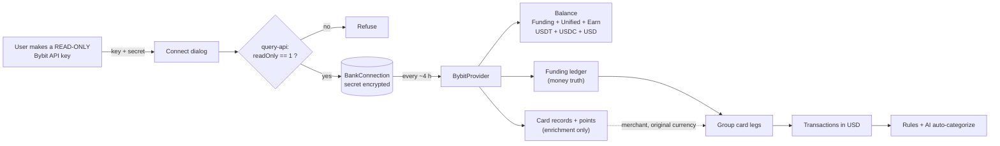
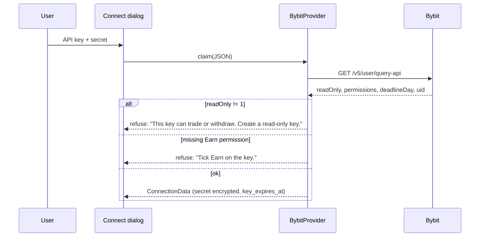

# Bybit provider for Securo — design

Date: 2026-10-03
Status: draft v2 (after adversarial review), awaiting owner review
Branch: `feat/bybit-provider`
Upstream interest: securo-finance/securo#768 ("Assets sync with wallets platforms")

## Goal

A Bybit account shows up in Securo as **one USD account** that syncs by itself:
the stablecoin balance, every Bybit Card payment (merchant and original
currency), deposits, withdrawals, P2P sales, Earn interest and card cashback.
Card payments then flow through the existing rules and AI auto-categorize.

Scope: **dollar stablecoins only** (USDT, USDC) plus the USD fiat leg the card
uses. No trading, no other coins, no holdings.

## Principles

1. **The Funding ledger is the only source of money.** Every amount Securo
   books comes from ledger rows. Card records and reward points only add names.
2. **A row's identity comes from the ledger only.** Whether the card API
   answered never changes an `external_id` or an amount. Securo dedups on
   `(account_id, external_id)` and never updates the amount of an existing row,
   so an identity that depended on enrichment would double-count.
3. **Never move money.** Read-only key enforced; every request goes through one
   guard that only knows read endpoints.

## Facts from a live probe

A read-only probe against a real key (structure and ratios only, nothing
recorded) settled what the docs leave open:

| Question | Answer |
|---|---|
| Read-only key + card | `readOnly: 1` with the `BitCard` permission reads card records. Trade permissions still appear in the list on a read-only key, so **`readOnly` is the field to check**, not the permission list. |
| Card POST signing | JSON body, signed `ts + key + recv_window + body`. Query-string forms return `10004`. |
| Card rate limit | Undocumented but real: bursts return `10006`. Space card calls ≥ 1.5 s. |
| Ledger | `fundinghistory` reaches back ≥ 300 days; `currcCursor` is unique per row; `afterAmt` is a consistent running balance per currency. |
| A card purchase in the ledger | 2–5 `Bybit Card` legs within ~1 s: USDT out (`Sale` and/or `Purchase`), an Earn `card redemption` in when Auto-Earn funded it, and a USD `Coin Purchase` in / `Purchase` out pair. |
| Card record fields | `basicAmount` = USD charged. **`paidAmount`/`paidCurrency` = the merchant's amount and currency.** `transactionCurrency` is always USD. Fee fields are zero. |
| Auth vs clearing | Different `txnId`s. Purchases are `AUTH_ALL` rows with `cryptoSold = true`; zero-amount auths are verifications and are ignored. |
| Cashback | Points; redeeming them credits an `Airdrop` / `Airdrop Bonus` USDT row of the same amount within ~1 h. |
| Earn | `/v5/earn/position` works on a read-only key with the `Earn` permission. |

## Balance

`balance = Σ(USDT, USDC, USD)` across:

| Wallet | Endpoint |
|---|---|
| Funding | `GET /v5/asset/transfer/query-account-coins-balance?accountType=FUND` |
| Unified | `GET /v5/account/wallet-balance?accountType=UNIFIED&coin=USDT,USDC,USD` (`walletBalance`) |
| Earn flexible | `GET /v5/earn/position?category=FlexibleSaving` (`amount` + `claimableYield`) |

USDT and USDC count 1:1 as USD. `AccountData.currency = "USD"`, and **every
`TransactionData.currency = "USD"`**; the coin code lives in `raw_data`.
(`currency` columns are `String(3)`; `"USDT"` would fail the insert.)

Earn must be counted: when Auto-Earn funds a purchase, the money leaves Earn,
and the ledger's `Sale` leg is the only trace of it.

## Transactions

### Fetch

- Ledger: contiguous, half-open 7-day windows (`createTimeFrom/To`, **seconds**),
  cursor-paged. All windows are fetched first and deduplicated on
  `currcCursor`; grouping runs once over the whole range. The first sync walks
  52 weeks (52 calls at ≤ 10/s ≈ 6 s).
- The range starts 60 s before `since`. A cluster is emitted only if its first
  row is at or after `since`; one that starts earlier was booked whole by an
  earlier sync. This keeps identities stable at the outer edge too.
- Card: `SIDE_QUERY_AUTH_ALL` for the whole range in one paged call (limit
  500). Points records: one paged call.
- Internally every timestamp is **integer seconds UTC**; card `txnCreate`
  (ms) and point `createTime` are converted at the boundary.

### Map

Only USDT, USDC and USD rows. `amount` positive, direction from `ioDirection`.

| Ledger `showBusiTypeEn` / `descriptionEn` | Securo |
|---|---|
| `Bybit Card` legs | grouped, see below |
| `Earn` `Flexible (Auto-Earn)`, `Flexible Redemption`, `card redemption` | skipped: moves inside the account |
| `Earn` `Flexible Interest Distribution` | credit "Bybit Earn interest"; rows that round to 0.00 are skipped |
| `Deposit` / `Deposit (Internal Transfer)` | credit |
| `Withdraw` / `Withdraw (Internal Transfer)` | debit |
| `Fiat` `P2P Sale` / `Canceled P2P Sale` | debit / credit |
| `Airdrop` `Airdrop Bonus` | credit; "Bybit Card cashback" when a points redemption of the same amount is within 2 h, else "Bybit bonus" |
| `Bybit Pay` transfer | debit |
| Transfer Funding ↔ Unified | skipped only when `query-inter-transfer-list` shows a FUND↔UNIFIED transfer of the same coin and amount within ±10 s. Called only for windows that contain an unrecognised row. |
| **Anything else** | imported as-is (`descriptionEn`), logged once per new type. Never dropped. |

Single rows: `external_id = "bybit:" + currcCursor`.

### Group a card purchase

1. **Cluster** all `Bybit Card` rows (USDT, USDC, USD) by time: a row joins the
   cluster if it is ≤ 5 s after the previous row.
2. **Amount** = signed sum of the cluster's USDT/USDC legs (O minus I).
   Positive → one debit; negative → one credit; zero → nothing.
   The USD `Coin Purchase`/`Purchase` pair is dropped **only if** the cluster's
   USD rows net to exactly zero; otherwise the USD rows are booked as plain rows.
3. **Identity** = `"bybit-card:" + smallest currcCursor in the cluster`. Ledger only.
4. **Enrich** (optional): the `cryptoSold` card record whose `txnCreate` is
   nearest the cluster, within ±10 s, is attached when
   `cluster USDT sum ÷ basicAmount` is between 0.99 and 1.05. Each record
   enriches at most one cluster.
   - description and payee = `merchName`; foreign purchases add the original
     amount: `"AMAZON (EUR 54.00)"`
   - unenriched clusters get description "Bybit Card" and an **empty payee**,
     so a later sync can still fill the payee with `merchName` (Securo fills an
     empty payee on existing rows; it never rewrites the description).
5. **Settle time:** clusters whose newest row is younger than 10 minutes are
   always left for the next sync, so a half-posted purchase is never frozen at
   a partial amount (Securo never updates an existing row's amount).
6. **Hold-back:** after a *transient* card failure (timeout, 5xx, `10006`),
   clusters younger than 72 h are also left for the next sync, so they are
   enriched before they are first written. A key without `BitCard` is not
   transient: its clusters are written at once, unenriched. If the card API
   answered and nothing matched, the cluster is written unenriched.

Refunds: no refund has been observed. A USDT `Bybit Card` `I` cluster becomes
a credit through the same rule. Naming it from
`SIDE_QUERY_FINANCIAL_REFUND` is best-effort (match on amount within 30 days)
and marked unverified until a real refund is seen.

### Drift check

Checked against what was **emitted**, summed over USDT + USDC + USD (clusters
mix coins), with rows ordered by `createTime` then `currcCursor`:

Σ signed emitted amounts + Σ rows skipped as internal + Σ rows rounded to
0.00 + Σ held-back clusters + Σ rows before `since` = Σ per-currency
(`afterAmt` of last row − (`afterAmt` − signed `txnAmt`) of first row).

A mismatch is logged as a warning with the stage and the gap. This catches
fetch gaps and mapping errors (a wrong grouped sum, a USD row wrongly dropped)
that Securo's opening-balance plug would otherwise hide. It does not cover
the Earn wallet, which has no ledger.

## Connect, validate, expire

- `readOnly` must be integer `1`, read only after `retCode == 0`. Checked at
  connect and in `refresh_credentials` on every sync.
- `Earn` permission required (balance depends on it). `BitCard` optional:
  without it, card rows read "Bybit Card".
- `refresh_credentials` re-reads `query-api` each sync and returns the
  credentials with an updated `key_expires_at`; Securo persists that dict.
  No `connection_service.py` change.
- Expired or revoked key (`10003`, `33004`, `10005` on `query-api`) →
  `SessionExpiredError` → Securo's existing reconnect banner. Reconnect
  replaces the key in place (never re-add: that duplicates everything).
- Unbound keys last 90 days. Securo has no pre-expiry warning UI, so the
  reminder is a calendar event 14 days before `key_expires_at`, made by
  whoever connects the key.
- Connection `external_id = "bybit:" + sha256(uid)[:16]`, so the raw uid is
  never stored.
- Claim time: connect returns the account, balance and full history in one
  request (≈ 10 s: 52 ledger calls + 1–2 card calls). `10006` at claim maps to
  `ProviderUserActionRequired` "Bybit is rate-limiting, try again in a minute".

## Safety

| Rule | How |
|---|---|
| Never move money | One `_request(method, path)` raises unless `(method, path)` is in a frozen allowlist of exact read endpoints. Tests: the runtime refusal, plus a source scan that every string containing `v5/` is in the allowlist and none starts with a write prefix (`/v5/order/`, `/v5/asset/withdraw/create`, `/v5/asset/transfer/inter-transfer`, `/v5/asset/transfer/universal-transfer`, `/v5/user/update-api`, …). |
| Secret at rest | `api_secret` (and `api_key`) via `app.agents.services.crypto.encrypt`; refuse to store plaintext if encryption fails. If `decrypt` returns nothing (rotated `SECRET_KEY`), raise `ProviderUserActionRequired("bybit_credential_unreadable")` before any network call. |
| Secret and data in errors | Every entry point lets only `BybitError(stage, retCode)`, `SessionExpiredError`, `ProviderRateLimited` or `ProviderUserActionRequired` escape, raised `from None`. Tests walk `str()`, `__cause__` and `__context__` for the key, the secret, the signature and response values. |
| Personal data | `raw_data` is an **allowlist**. Ledger: `currcCursor, showBusiTypeEn, descriptionEn, currency, ioDirection, txnAmt, createTime`. Card: `side, merchName, mccCode, merchCategoryDesc, paidAmount, paidCurrency, basicAmount`. Addresses, txIDs, uids, `pan6`, `memberId` never stored. Securo merges `raw_data` forever, so a field stored once can't be removed later. |
| Secret field in the UI | `credential_fields` entries carry `secret: true` → `type=password`, `autoComplete=new-password`. |
| Fixtures | Fully synthetic. Nothing from the live probe. |
| Egress | No change: backend and worker already reach public 443. |

## Files

| File | Change |
|---|---|
| `backend/app/providers/bybit.py` | new: guarded client + signing, balance, ledger walk, grouping, enrichment, mapping, drift check |
| `backend/app/providers/__init__.py` | `KNOWN_PROVIDERS` entry (`flow_type: credentials`, `credential_fields`); register when `bybit_enabled` |
| `backend/app/core/config.py` | `bybit_enabled`, `bybit_base_url` (default `https://api.bybit.com`) |
| `frontend/src/components/credentials-connect-dialog.tsx` | fields from `credential_fields` (default user ID + password, so Access Bank is unchanged); per-provider `privacyNote` with the generic fallback |
| `frontend/src/lib/api.ts`, `frontend/src/types/index.ts` | carry `credential_fields` |
| `frontend/src/locales/*.json` (15) | `accounts.credentialsConnect.bybit.*`, field labels, privacy note |
| `docker-compose*.yml`, `deploy/values.yaml` | `BYBIT_ENABLED` (the release renders `deploy/manifests.yaml`) |
| `backend/tests/test_providers_bybit.py` | new |
| `frontend/src/components/credentials-connect-dialog.test.tsx` | field-driven dialog, masked secret |

No migration. No change to `connection_service.py` or the sync schedule.

## Errors

| Bybit | Securo |
|---|---|
| `10006` / HTTP 403 rate limit | back off 1.5 s → 10 s → 20 s; still limited → `ProviderRateLimited` (skipped, retried next run); at claim → `ProviderUserActionRequired` |
| `10003`, `33004`, `10005` on `query-api` | `SessionExpiredError` |
| `10005` on card or points | continue unenriched, written at once (missing permission is not transient) |
| timeout / 5xx / `10006` on card or points | continue; 72 h hold-back for young clusters |
| `10005` on Earn | `ProviderUserActionRequired` "Tick Earn on the key" |
| `10002` timestamp | resync offset from `/v5/market/time` once, retry |
| anything else | `BybitError(stage, retCode)` → connection error |

## Testing

- HMAC known-answer tests: GET query string and POST JSON body.
- Guard: an unlisted path raises before any network I/O; source scan as above.
- Mapping: one synthetic ledger covering every row type, an unknown type, and a non-stable coin (ignored).
- Grouping:
  - Auto-Earn purchase (Sale + card redemption + Purchase + USD pair) → one debit = Sale + Purchase.
  - Two purchases 30 s apart → two debits, correct amounts.
  - Legs straddling a 7-day window edge → one debit.
  - USD rows that don't net to zero → booked.
  - Card API down then up across two syncs over the same window → **no new rows**.
  - Hold-back: transient card failure, cluster younger than 72 h → not written; older → written unenriched. No `BitCard` → written at once.
  - Settle time: a cluster with a row younger than 10 min → not written.
  - Legs straddling `since` → not re-emitted under a new id.
  - Unenriched cluster has an empty payee; a later sync fills it.
- Balance: Funding + Unified + Earn summed; all `currency == "USD"`.
- Drift check: consistent ledger → no warning; a dropped row → warning.
- Connect: read-only refused, Earn missing refused, BitCard missing allowed, expiry stored, uid hashed.
- Errors: rate-limit backoff then success; three `10006` → `ProviderRateLimited`; expired key → `SessionExpiredError`; unreadable secret → `ProviderUserActionRequired`; nothing secret in any exception chain.
- `raw_data`: a synthetic row with an address/txID field does not store it.
- Frontend: dialog renders the provider's fields, masks the secret; Access Bank unchanged; locale parity.

## Out of scope (later)

RedotPay (statement import). Other coins and trading. Unified-account ledger
rows (`/v5/account/transaction-log`), if that wallet is ever used. Refusing a
reconnect with a key from a different Bybit account (needs a
`connection_service.py` check). Upstream PR for #768 after a few weeks here.
